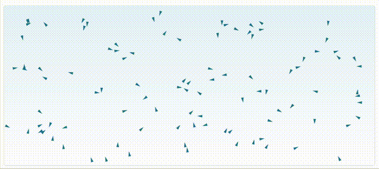

# Boids Flocking Simulator

This project implements **Craig Reynolds’ Boids Algorithm (1986)** in MATLAB to simulate realistic flocking behavior using three simple emergent-behavior rules:

1. **Separation** - avoid crowding neighbors  
2. **Alignment** - steer toward the average heading of nearby boids  
3. **Cohesion** - move toward the center of mass of the flock  

---

## Simulation Previews

### Web Visualization
This is a clean preview generated for the README:



### Octave Simulation Output
This GIF shows the actual visual output produced when running the simulation in Octave:


---

## Running the Simulation

```
octave boids.m
```


